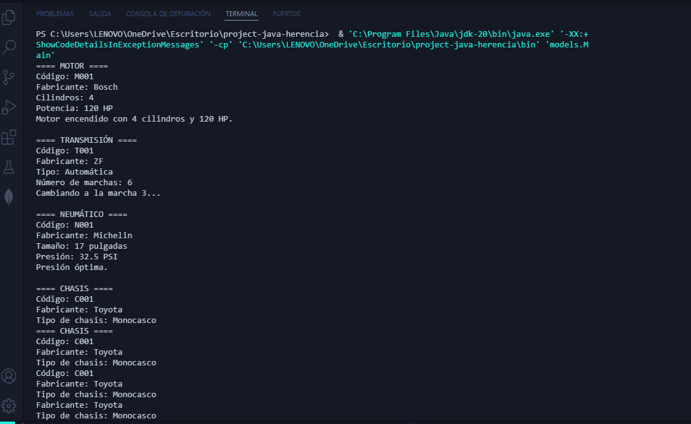

# 🚗 Playground: Herencia en Java – Componentes vehiculares con comportamientos particulares

Este proyecto muestra una implementación de herencia en Java mediante componentes vehiculares. Cada componente tiene una clase que hereda de una clase base común `ComponenteVehicular` y agrega comportamientos particulares.

---

## 📁 Estructura del Proyecto

- `ComponenteVehicular.java`: Clase base con atributos comunes (`codigo`, `fabricante`) y un método para mostrar información.
- `Motor.java`: Subclase que implementa `encenderMotor()`.
- `Transmision.java`: Subclase que implementa `cambiarMarcha(int marcha)`.
- `Neumatico.java`: Subclase que implementa `verificarPresion()`.
- `Chasis.java`: Subclase que implementa `calcularCargaMaxima()`.
- `SistemaFrenos.java`: Subclase que implementa `verificarABS()`.
- `Main.java`: Clase principal que crea instancias de todos los componentes y prueba sus métodos.

---

## 🧬 Jerarquía de Clases

```
ComponenteVehicular
├── Motor
├── Transmision
├── Neumatico
├── Chasis
└── SistemaFrenos
```

---

## ⚙️ Comportamientos Particulares

| Clase           | Método particular      | Funcionalidad                                                   |
|----------------|------------------------|------------------------------------------------------------------|
| `Motor`         | `encenderMotor()`       | Imprime mensaje de encendido con potencia y cilindros           |
| `Transmision`   | `cambiarMarcha(int)`    | Cambia la marcha validando el rango disponible                  |
| `Neumatico`     | `verificarPresion()`    | Valida si la presión está dentro del rango recomendado          |
| `Chasis`        | `calcularCargaMaxima()` | Calcula carga máxima estimada según peso del chasis             |
| `SistemaFrenos` | `verificarABS()`        | Verifica si el sistema ABS está presente                        |

---

## 🖥️ Ejecución

Al ejecutar `Main.java`, verás en consola la información detallada de cada componente y el resultado de sus métodos particulares.

---

## 📸 Captura de pantalla esperada



---

## ✅ Autor

- Adrián Camilo Morales
